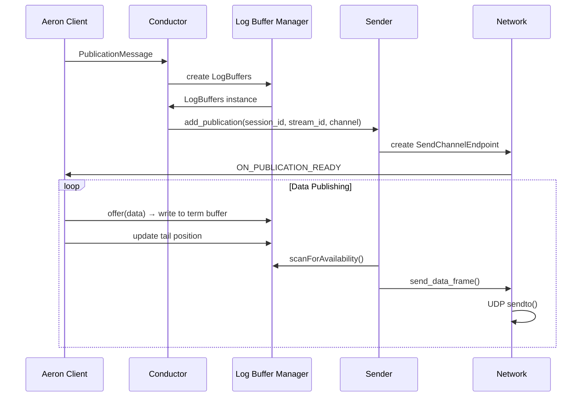
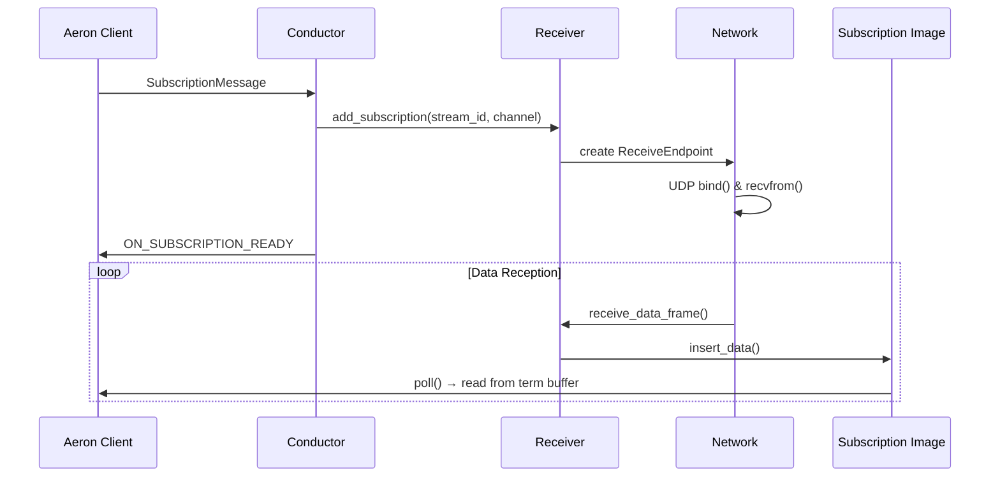

# Aeron 架构与数据流图

## 概述

Aeron是一个高性能的消息传输系统，采用零拷贝、低延迟的设计理念，专门为**跨进程**和**跨机器**的通信而设计。本文档详细描述了Aeron的架构设计和数据流图。

## 核心架构组件

### 1. 主要组件

```
┌─────────────────┐    ┌─────────────────┐    ┌─────────────────┐
│   Aeron Client  │    │  Media Driver   │    │   Network       │
│                 │    │                 │    │                 │
│ ┌─────────────┐ │    │ ┌─────────────┐ │    │ ┌─────────────┐ │
│ │ Publication │ │    │ │  Conductor  │ │    │ │   Sender    │ │
│ └─────────────┘ │    │ └─────────────┘ │    │ └─────────────┘ │
│ ┌─────────────┐ │    │ ┌─────────────┐ │    │ ┌─────────────┐ │
│ │Subscription │ │    │ │ Log Buffer  │ │    │ │  Receiver   │ │
│ └─────────────┘ │    │ │  Manager    │ │    │ └─────────────┘ │
│ ┌─────────────┐ │    │ └─────────────┘ │    │ ┌─────────────┐ │
│ │   Image     │ │    │ ┌─────────────┐ │    │ │ Send Channel│ │
│ └─────────────┘ │    │ │ Network     │ │    │ │  Endpoint   │ │
└─────────────────┘    │ │Publication  │ │    │ └─────────────┘ │
                       │ └─────────────┘ │    │ ┌─────────────┐ │
                       │ ┌─────────────┐ │    │ │Receive End- │ │
                       │ │ Subscription│ │    │ │   point     │ │
                       │ │   Image     │ │    │ └─────────────┘ │
                       │ └─────────────┘ │    └─────────────────┘
                       └─────────────────┘
```

### 2. 跨进程/跨机器通信架构

```
┌─────────────────────────────────────────────────────────────┐
│                    Aeron 通信模式                            │
├─────────────────────────────────────────────────────────────┤
│                                                             │
│  ┌─────────────┐    ┌─────────────┐    ┌─────────────┐     │
│  │  进程A      │    │  进程B      │    │  进程C      │     │
│  │ (Publisher) │    │ (Subscriber)│    │ (Subscriber)│     │
│  └─────────────┘    └─────────────┘    └─────────────┘     │
│         │                   │                   │           │
│         └───────────────────┼───────────────────┘           │
│                             │                               │
│                    ┌─────────┴─────────┐                    │
│                    │   Media Driver    │                    │
│                    │  (独立进程)        │                    │
│                    └───────────────────┘                    │
│                             │                               │
│                    ┌─────────┴─────────┐                    │
│                    │   Network Layer   │                    │
│                    │   (UDP/TCP)       │                    │
│                    └───────────────────┘                    │
│                                                             │
└─────────────────────────────────────────────────────────────┘

共享内存通信 (同机器):
┌─────────────────────────────────────────────────────────────┐
│                    Shared Memory Files                       │
├─────────────────────────────────────────────────────────────┤
│  to-driver    │  to-client     │  pub-{id}    │  sub-{id}   │
│  (Control)    │  (Response)    │  (Log Buffer)│  (Log Buffer)│
│               │                │              │              │
│ ┌───────────┐ │ ┌───────────┐  │ ┌──────────┐ │ ┌──────────┐ │
│ │Publication│ │ │Response   │  │ │Term 0    │ │ │Term 0    │ │
│ │Message    │ │ │Message    │  │ │Term 1    │ │ │Term 1    │ │
│ │Subscription│ │ │Error      │  │ │Term 2    │ │ │Term 2    │ │
│ │Message    │ │ │Message    │  │ │Metadata  │ │ │Metadata  │ │
│ └───────────┘ │ └───────────┘  │ └──────────┘ │ └──────────┘ │
└─────────────────────────────────────────────────────────────┘
```

## 详细数据流图

### 1. Publication 数据流



### 2. Subscription 数据流



### 3. 三重缓冲 Log Buffer 结构

```
┌─────────────────────────────────────────────────────────────┐
│                    Triple Buffer Layout                     │
├─────────────────────────────────────────────────────────────┤
│  Term 0 Buffer (64KB)  │  Term 1 Buffer (64KB)  │  Term 2   │
│  ┌─────────────────┐   │  ┌─────────────────┐   │  Buffer   │
│  │ Frame Header    │   │  │ Frame Header    │   │  (64KB)   │
│  │ Data Payload    │   │  │ Data Payload    │   │  ┌──────┐ │
│  │ Padding         │   │  │ Padding         │   │  │Frame │ │
│  └─────────────────┘   │  └─────────────────┘   │  │Header│ │
│                        │                        │  │Data  │ │
├─────────────────────────────────────────────────────────────┤
│                    Metadata Buffer (4KB)                   │
│  ┌─────────────────────────────────────────────────────────┐ │
│  │ Term Length │ Page Size │ Initial Term ID │ MTU Length │ │
│  │ Tail Counters (3x)     │ Active Term Count│ Correlation│ │
│  └─────────────────────────────────────────────────────────┘ │
└─────────────────────────────────────────────────────────────┘
```
### 4. 三重缓冲工作原理

```
状态转换图：
┌─────────────┐  ┌─────────────┐  ┌─────────────┐
│   Term 0    │  │   Term 1    │  │   Term 2    │
│  (Writing)  │  │  (Reading)  │  │  (Standby)  │
└─────────────┘  └─────────────┘  └─────────────┘
     ↓                   ↓              ↓
  写入数据            读取数据         备用缓冲
     ↓                   ↓              ↓
  切换到Term 1       切换到Term 2    切换到Term 0

详细工作流程：
1. 初始状态: Term 0 (Writing), Term 1 (Reading), Term 2 (Standby)
2. Term 0 写满后: Term 0 → Reading, Term 1 → Writing, Term 2 → Standby
3. Term 1 写满后: Term 1 → Reading, Term 2 → Writing, Term 0 → Standby
4. Term 2 写满后: Term 2 → Reading, Term 0 → Writing, Term 1 → Standby
5. 循环往复...

关键问题处理：
• 写满两个buffer的情况：当写入速度远快于读取速度时
• 背压机制：当所有buffer都被占用时，写入端需要等待
• 流控制：基于读取位置动态调整写入策略
• 溢出保护：防止数据丢失，确保消息完整性

优势：
• 写入和读取可以同时进行，无需锁机制
• 避免了读写竞争，最大化并发性能
• 简单可靠的状态转换逻辑
• 适合高吞吐量、低延迟场景
• 内置背压机制，防止系统过载
```

### 5. 多生产者支持分析

#### **Aeron的设计哲学：单生产者，多消费者**

```
┌─────────────────────────────────────────────────────────────┐
│                    Aeron 多生产者架构                        │
├─────────────────────────────────────────────────────────────┤
│                                                             │
│  ┌─────────────┐    ┌─────────────┐    ┌─────────────┐     │
│  │ Publisher A │    │ Publisher B │    │ Publisher C │     │
│  │ Session=1   │    │ Session=2   │    │ Session=3   │     │
│  └─────────────┘    └─────────────┘    └─────────────┘     │
│         │                   │                   │           │
│         └───────────────────┼───────────────────┘           │
│                             │                               │
│                    ┌─────────┴─────────┐                    │
│                    │   Media Driver    │                    │
│                    │  (独立进程)        │                    │
│                    └───────────────────┘                    │
│                             │                               │
│                    ┌─────────┴─────────┐                    │
│                    │   Log Buffers     │                    │
│                    │                   │                    │
│                    │ pub-1  pub-2  pub-3│                    │
│                    │ ┌───┐  ┌───┐  ┌───┐│                    │
│                    │ │T0 │  │T0 │  │T0 ││                    │
│                    │ │T1 │  │T1 │  │T1 ││                    │
│                    │ │T2 │  │T2 │  │T2 ││                    │
│                    │ └───┘  └───┘  └───┘│                    │
│                    └───────────────────┘                    │
│                             │                               │
│                    ┌─────────┴─────────┐                    │
│                    │   Subscribers     │                    │
│                    │  (多消费者)        │                    │
│                    └───────────────────┘                    │
│                                                             │
└─────────────────────────────────────────────────────────────┘
```

#### **为什么Aeron选择单生产者设计？**

##### **1. 性能考虑**
```cpp
// 单生产者：无锁写入，原子操作
std::atomic<std::int64_t>* tailCounter = ...;
tailCounter->fetch_add(frame_length, std::memory_order_release);

// 多生产者：需要CAS操作，性能下降
std::atomic<std::int64_t>* tailCounter = ...;
std::int64_t current_tail, new_tail;
do {
    current_tail = tailCounter->load(std::memory_order_acquire);
    new_tail = current_tail + frame_length;
} while (!tailCounter->compare_exchange_weak(current_tail, new_tail, 
                                            std::memory_order_release));
```

##### **2. 复杂性考虑**
```
单生产者三重缓冲：
┌─────────────┐  ┌─────────────┐  ┌─────────────┐
│   Term 0    │  │   Term 1    │  │   Term 2    │
│  (Writing)  │  │  (Reading)  │  │  (Standby)  │
└─────────────┘  └─────────────┘  └─────────────┘

多生产者三重缓冲（复杂）：
┌─────────────┐  ┌─────────────┐  ┌─────────────┐
│   Term 0    │  │   Term 1    │  │   Term 2    │
│(Producer A) │  │(Producer B) │  │(Producer C) │
│(Producer B) │  │(Producer C) │  │(Producer A) │
│(Producer C) │  │(Producer A) │  │(Producer B) │
└─────────────┘  └─────────────┘  └─────────────┘
```

##### **3. 实际应用场景**
```cpp
// Aeron的典型使用模式
// 每个服务实例有自己的Publication
class OrderService {
private:
    aeron::Publication order_pub_;  // Session ID = 1
    
public:
    void sendOrder(const Order& order) {
        order_pub_.offer(order.data(), order.size());
    }
};

class MarketDataService {
private:
    aeron::Publication market_pub_;  // Session ID = 2
    
public:
    void sendMarketData(const MarketData& data) {
        market_pub_.offer(data.data(), data.size());
    }
};

// 消费者可以订阅多个Publication
class TradingEngine {
private:
    aeron::Subscription order_sub_;      // 订阅Session 1
    aeron::Subscription market_sub_;     // 订阅Session 2
    
public:
    void processMessages() {
        // 处理订单消息
        order_sub_.poll(messageHandler);
        // 处理市场数据
        market_sub_.poll(messageHandler);
    }
};
```

#### **多生产者的替代方案**

##### **1. 多个Publication**
```cpp
// 方案1：每个生产者一个Publication
aeron::Publication pub1 = client.addPublication("aeron:udp?endpoint=localhost:40123", 1001);
aeron::Publication pub2 = client.addPublication("aeron:udp?endpoint=localhost:40123", 1002);
aeron::Publication pub3 = client.addPublication("aeron:udp?endpoint=localhost:40123", 1003);

// 每个Publication有独立的Session ID和Log Buffer
```

##### **2. 应用层聚合**
```cpp
// 方案2：应用层聚合多个生产者
class MessageAggregator {
private:
    std::vector<aeron::Publication> publications_;
    std::atomic<int> current_pub_{0};
    
public:
    void sendMessage(const Message& msg) {
        // 轮询选择Publication
        int pub_index = current_pub_.fetch_add(1) % publications_.size();
        publications_[pub_index].offer(msg.data(), msg.size());
    }
};
```

##### **3. 使用其他组件**
```cpp
// 方案3：使用Disruptor等支持多生产者的组件
class MultiProducerDisruptor {
private:
    disruptor::RingBuffer<Message> ring_buffer_;
    
public:
    void publish(const Message& msg) {
        // Disruptor支持多生产者
        ring_buffer_.publishEvent([&msg](Message& event) {
            event = msg;
        });
    }
};
```

#### **性能对比**

| 特性 | 单生产者 | 多生产者 |
|------|----------|----------|
| **写入性能** | 极高 (无锁) | 中等 (CAS操作) |
| **内存使用** | 低 | 高 |
| **实现复杂度** | 简单 | 复杂 |
| **调试难度** | 容易 | 困难 |
| **适用场景** | 高吞吐量 | 多线程写入 |

#### **Aeron的设计选择总结**

1. **性能优先**: 单生产者设计避免了锁竞争，最大化写入性能
2. **简单可靠**: 三重缓冲的单生产者模式简单且可靠
3. **实际需求**: 大多数应用场景中，每个服务实例只需要一个Publication
4. **扩展性**: 通过多个Publication和Session ID支持多生产者场景
5. **一致性**: 单生产者确保消息顺序和完整性

**结论**: Aeron的三重缓冲机制**不支持多生产者**，这是为了性能而做出的设计选择。在实际应用中，通过多个Publication（每个有独立的Session ID）来实现多生产者模式，这样既保持了高性能，又满足了多生产者的需求。

### 6. Frame 结构

```
┌─────────────────────────────────────────────────────────────┐
│                        Frame Header                         │
├─────────────────────────────────────────────────────────────┤
│ Version │ Flags │ Type │ Term Offset │ Session ID │ Stream │
│   (1B)  │ (1B)  │ (2B) │   (4B)     │   (4B)     │  ID    │
│         │       │      │            │            │ (4B)   │
├─────────────────────────────────────────────────────────────┤
│                    Data Payload                            │
│  ┌─────────────────────────────────────────────────────────┐ │
│  │                    Application Data                     │ │
│  └─────────────────────────────────────────────────────────┘ │
└─────────────────────────────────────────────────────────────┘
```

## 关键概念详解

### 1. 跨进程/跨机器通信 (Inter-Process/Inter-Machine Communication)

Aeron的核心设计就是为了支持分布式系统中的跨进程和跨机器通信：

#### 同机器跨进程通信
```
┌─────────────┐    ┌─────────────┐    ┌─────────────┐
│  进程A      │    │  进程B      │    │ Media Driver│
│ (Publisher) │    │(Subscriber) │    │ (独立进程)   │
│             │    │             │    │             │
│ ┌─────────┐ │    │ ┌─────────┐ │    │ ┌─────────┐ │
│ │Publication││    │ │Subscription││    │ │Conductor││
│ └─────────┘ │    │ └─────────┘ │    │ └─────────┘ │
└─────────────┘    └─────────────┘    └─────────────┘
       │                   │                   │
       └───────────────────┼───────────────────┘
                           │
                    ┌───────┴───────┐
                    │ Shared Memory │
                    │   Files       │
                    └───────────────┘
```

#### 跨机器通信
```
┌─────────────┐                    ┌─────────────┐
│  机器A      │                    │  机器B      │
│ (Publisher) │                    │(Subscriber) │
│             │                    │             │
│ ┌─────────┐ │    ┌─────────────┐ │ ┌─────────┐ │
│ │Publication││────│  Network    │─│ │Subscription││
│ └─────────┘ │    │  (UDP/TCP)  │ │ └─────────┘ │
│ ┌─────────┐ │    └─────────────┘ │ ┌─────────┐ │
│ │Media    │ │                    │ │Media    │ │
│ │Driver   │ │                    │ │Driver   │ │
│ └─────────┘ │                    │ └─────────┘ │
└─────────────┘                    └─────────────┘
```

#### 关键特性
- **进程隔离**: 每个应用进程独立运行，通过Media Driver通信
- **故障隔离**: 单个进程崩溃不影响其他进程
- **资源管理**: Media Driver统一管理网络资源和内存
- **负载均衡**: 支持多个Publisher和Subscriber
- **网络透明**: 应用层无需关心底层网络细节

### 2. 零拷贝 (Zero-Copy)

- **Publication**: 客户端直接写入共享内存，无需数据复制
- **Subscription**: 客户端直接从共享内存读取，无需数据复制
- **Network**: 使用内存映射文件，避免用户空间到内核空间的数据拷贝

### 3. 三重缓冲 (Triple Buffering)

- **三重缓冲设计**: 三个term buffer轮换使用，确保写入和读取的并发安全
- **无锁操作**: 使用原子操作和内存屏障保证线程安全
- **批量处理**: 支持批量消息的原子写入和读取
- **避免竞争**: 当一个buffer正在写入时，另一个可以安全读取，第三个作为备用
- **单生产者设计**: 每个Publication对应一个Session ID，确保单生产者写入
- **背压机制**: 当写入速度超过读取速度时，自动施加背压防止系统过载

### 4. 背压机制 (Backpressure)

```
背压场景分析：
┌─────────────┐  ┌─────────────┐  ┌─────────────┐
│   Term 0    │  │   Term 1    │  │   Term 2    │
│  (Writing)  │  │  (Reading)  │  │  (Writing)  │  ← 问题：两个buffer都在写入
└─────────────┘  └─────────────┘  └─────────────┘
     ↓                   ↓              ↓
  快速写入            慢速读取         快速写入
     ↓                   ↓              ↓
  等待读取完成        继续读取        等待读取完成

背压处理策略：
1. 检测机制：监控所有buffer的状态
2. 写入控制：当检测到背压时，减缓写入速度
3. 流控制：基于读取位置动态调整写入策略
4. 超时处理：设置合理的超时机制，避免无限等待
```

### 5. 内存屏障 (Memory Barriers)

```cpp
// 写入端
std::atomic<std::int64_t>* tailCounter = ...;
tailCounter->fetch_add(frame_length, std::memory_order_release);

// 读取端
std::int64_t tail_position = tailCounter->load(std::memory_order_acquire);
```

### 6. 控制协议

#### Publication Message
```
┌─────────────────────────────────────────────────────────────┐
│ ControlMessageHeader │ Stream ID │ Registration ID │ Channel │
│   (24 bytes)        │  (4 bytes)│   (8 bytes)     │ (var)   │
└─────────────────────────────────────────────────────────────┘
```

#### Subscription Message
```
┌─────────────────────────────────────────────────────────────┐
│ ControlMessageHeader │ Stream ID │ Registration ID │ Channel │
│   (24 bytes)        │  (4 bytes)│   (8 bytes)     │ (var)   │
└─────────────────────────────────────────────────────────────┘
```

### 7. 网络传输

#### UDP Channel URI 格式
```
aeron:udp?endpoint=host:port|control=host:port
```

#### 数据帧类型
- **DATA**: 应用数据帧
- **SETUP**: 连接建立帧
- **HEARTBEAT**: 心跳帧
- **NAK**: 否定确认帧

## 性能特性

### 1. 延迟优化
- **预分配内存**: 启动时预分配所有缓冲区
- **内存锁定**: 防止页面交换
- **CPU亲和性**: 绑定线程到特定CPU核心

### 2. 吞吐量优化
- **批量操作**: 支持批量消息处理
- **无锁设计**: 减少线程同步开销
- **内存对齐**: 优化内存访问模式

### 3. 可靠性保证
- **流控制**: 基于背压的流控制机制
- **重传**: NAK机制处理丢包
- **心跳**: 定期心跳检测连接状态

## 配置参数

### 关键配置项
```properties
# Term Buffer Size
aeron.term.buffer.length=64KB

# MTU Length
aeron.mtu.length=1408

# Page Size
aeron.page.size=4KB

# Initial Term ID
aeron.initial.term.id=1

# Keepalive Interval
aeron.client.keepalive.interval=10ms
```

## 监控指标

### 核心指标
- **Publication Position**: 发布位置
- **Subscription Position**: 订阅位置
- **Network Round Trip Time**: 网络往返时间
- **Loss Rate**: 丢包率
- **Throughput**: 吞吐量

### 健康检查
- **Heartbeat**: 定期心跳检测
- **Position Monitoring**: 位置监控
- **Error Detection**: 错误检测和报告

## 总结

Aeron的架构设计体现了高性能消息传输系统的核心原则：

1. **跨进程/跨机器**: 专门为分布式系统设计，支持进程间和机器间通信
2. **零拷贝**: 最大化减少数据移动
3. **三重缓冲**: 三个term buffer轮换，确保读写并发安全
4. **无锁设计**: 最小化线程同步开销
5. **内存映射**: 利用操作系统内存管理
6. **批量处理**: 提高处理效率
7. **流控制**: 保证系统稳定性

**三重缓冲的优势：**
- **并发安全**: 写入和读取可以同时进行，无需锁
- **延迟优化**: 避免读写竞争，减少等待时间
- **吞吐量提升**: 最大化利用CPU和内存带宽
- **简单可靠**: 相比复杂的锁机制，三重缓冲更简单且更可靠

这种设计使得Aeron能够在微秒级延迟下处理数百万消息/秒的吞吐量，成为金融交易、游戏、实时分析等低延迟应用的首选消息传输系统。

**Aeron的分布式特性使其特别适合：**
- **微服务架构**: 服务间的高性能通信
- **事件驱动系统**: 实时事件流处理
- **分布式计算**: 节点间的数据交换
- **实时监控**: 跨机器的监控数据收集
- **高频交易**: 低延迟的订单路由
