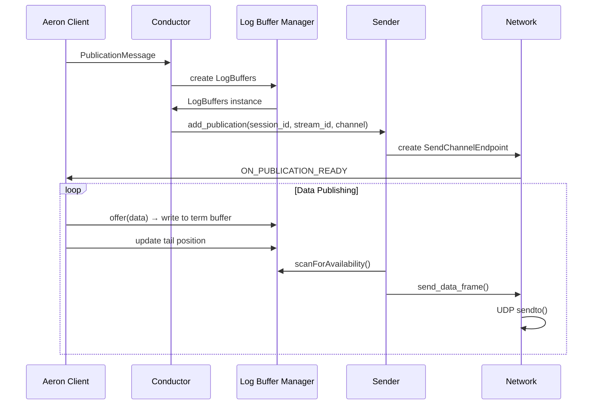
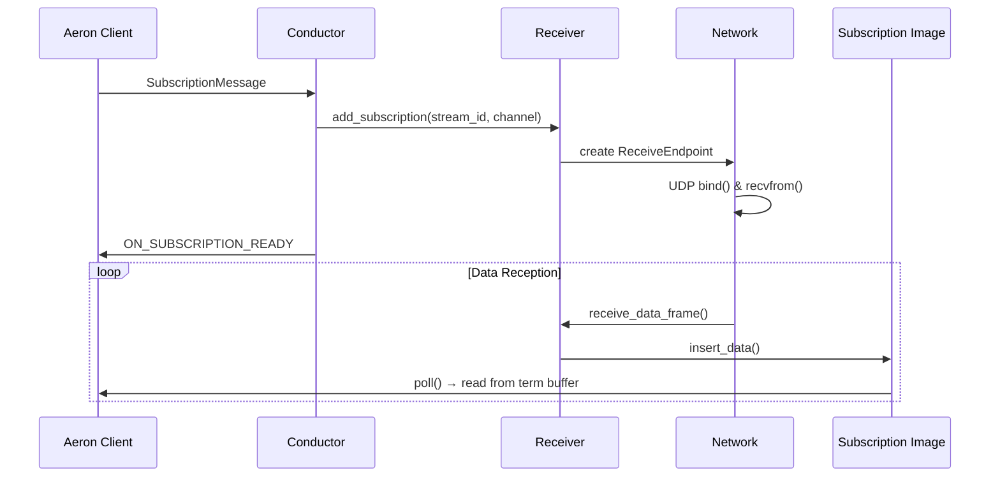

# Aeron 架构与数据流图

## 概述

Aeron是一个高性能的消息传输系统，采用零拷贝、低延迟的设计理念。本文档详细描述了Aeron的架构设计和数据流图。

## 核心架构组件

### 1. 主要组件

```
┌─────────────────┐    ┌─────────────────┐    ┌─────────────────┐
│   Aeron Client  │    │  Media Driver   │    │   Network       │
│                 │    │                 │    │                 │
│ ┌─────────────┐ │    │ ┌─────────────┐ │    │ ┌─────────────┐ │
│ │ Publication │ │    │ │  Conductor  │ │    │ │   Sender    │ │
│ └─────────────┘ │    │ └─────────────┘ │    │ └─────────────┘ │
│ ┌─────────────┐ │    │ ┌─────────────┐ │    │ ┌─────────────┐ │
│ │Subscription │ │    │ │ Log Buffer  │ │    │ │  Receiver   │ │
│ └─────────────┘ │    │ │  Manager    │ │    │ └─────────────┘ │
│ ┌─────────────┐ │    │ └─────────────┘ │    │ ┌─────────────┐ │
│ │   Image     │ │    │ ┌─────────────┐ │    │ │ Send Channel│ │
│ └─────────────┘ │    │ │ Network     │ │    │ │  Endpoint   │ │
└─────────────────┘    │ │Publication  │ │    │ └─────────────┘ │
                       │ └─────────────┘ │    │ ┌─────────────┐ │
                       │ ┌─────────────┐ │    │ │Receive End- │ │
                       │ │ Subscription│ │    │ │   point     │ │
                       │ │   Image     │ │    │ └─────────────┘ │
                       │ └─────────────┘ │    └─────────────────┘
                       └─────────────────┘
```

### 2. 共享内存通信

```
┌─────────────────────────────────────────────────────────────┐
│                    Shared Memory Files                       │
├─────────────────────────────────────────────────────────────┤
│  to-driver    │  to-client     │  pub-{id}    │  sub-{id}   │
│  (Control)    │  (Response)    │  (Log Buffer)│  (Log Buffer)│
│               │                │              │              │
│ ┌───────────┐ │ ┌───────────┐  │ ┌──────────┐ │ ┌──────────┐ │
│ │Publication│ │ │Response   │  │ │Term 0    │ │ │Term 0    │ │
│ │Message    │ │ │Message    │  │ │Term 1    │ │ │Term 1    │ │
│ │Subscription│ │ │Error      │  │ │Term 2    │ │ │Term 2    │ │
│ │Message    │ │ │Message    │  │ │Metadata  │ │ │Metadata  │ │
│ └───────────┘ │ └───────────┘  │ └──────────┘ │ └──────────┘ │
└─────────────────────────────────────────────────────────────┘
```

## 详细数据流图

### 1. Publication 数据流



### 2. Subscription 数据流



### 3. 三重缓冲 Log Buffer 结构

```
┌─────────────────────────────────────────────────────────────┐
│                    Triple Buffer Layout                     │
├─────────────────────────────────────────────────────────────┤
│  Term 0 Buffer (64KB)  │  Term 1 Buffer (64KB)  │  Term 2   │
│  ┌─────────────────┐   │  ┌─────────────────┐   │  Buffer   │
│  │ Frame Header    │   │  │ Frame Header    │   │  (64KB)   │
│  │ Data Payload    │   │  │ Data Payload    │   │  ┌──────┐ │
│  │ Padding         │   │  │ Padding         │   │  │Frame │ │
│  └─────────────────┘   │  └─────────────────┘   │  │Header│ │
│                        │                        │  │Data  │ │
├─────────────────────────────────────────────────────────────┤
│                    Metadata Buffer (4KB)                   │
│  ┌─────────────────────────────────────────────────────────┐ │
│  │ Term Length │ Page Size │ Initial Term ID │ MTU Length │ │
│  │ Tail Counters (3x)     │ Active Term Count│ Correlation│ │
│  └─────────────────────────────────────────────────────────┘ │
└─────────────────────────────────────────────────────────────┘
```
### 4. 三重缓冲工作原理

```
状态转换图：
┌─────────────┐  ┌─────────────┐  ┌─────────────┐
│   Term 0    │  │   Term 1    │  │   Term 2    │
│  (Writing)  │  │  (Reading)  │  │  (Standby)  │
└─────────────┘  └─────────────┘  └─────────────┘
     ↓                   ↓              ↓
  写入数据            读取数据         备用缓冲
     ↓                   ↓              ↓
  切换到Term 1       切换到Term 2    切换到Term 0

详细工作流程：
1. 初始状态: Term 0 (Writing), Term 1 (Reading), Term 2 (Standby)
2. Term 0 写满后: Term 0 → Reading, Term 1 → Writing, Term 2 → Standby
3. Term 1 写满后: Term 1 → Reading, Term 2 → Writing, Term 0 → Standby
4. Term 2 写满后: Term 2 → Reading, Term 0 → Writing, Term 1 → Standby
5. 循环往复...

优势：
• 写入和读取可以同时进行，无需锁机制
• 避免了读写竞争，最大化并发性能
• 简单可靠的状态转换逻辑
• 适合高吞吐量、低延迟场景
```

### 5. Frame 结构

```
┌─────────────────────────────────────────────────────────────┐
│                        Frame Header                         │
├─────────────────────────────────────────────────────────────┤
│ Version │ Flags │ Type │ Term Offset │ Session ID │ Stream │
│   (1B)  │ (1B)  │ (2B) │   (4B)     │   (4B)     │  ID    │
│         │       │      │            │            │ (4B)   │
├─────────────────────────────────────────────────────────────┤
│                    Data Payload                            │
│  ┌─────────────────────────────────────────────────────────┐ │
│  │                    Application Data                     │ │
│  └─────────────────────────────────────────────────────────┘ │
└─────────────────────────────────────────────────────────────┘
```

## 关键概念详解

### 1. 零拷贝 (Zero-Copy)

- **Publication**: 客户端直接写入共享内存，无需数据复制
- **Subscription**: 客户端直接从共享内存读取，无需数据复制
- **Network**: 使用内存映射文件，避免用户空间到内核空间的数据拷贝

### 2. 三重缓冲 (Triple Buffering)

- **三重缓冲设计**: 三个term buffer轮换使用，确保写入和读取的并发安全
- **无锁操作**: 使用原子操作和内存屏障保证线程安全
- **批量处理**: 支持批量消息的原子写入和读取
- **避免竞争**: 当一个buffer正在写入时，另一个可以安全读取，第三个作为备用

### 3. 内存屏障 (Memory Barriers)

```cpp
// 写入端
std::atomic<std::int64_t>* tailCounter = ...;
tailCounter->fetch_add(frame_length, std::memory_order_release);

// 读取端
std::int64_t tail_position = tailCounter->load(std::memory_order_acquire);
```

### 4. 控制协议

#### Publication Message
```
┌─────────────────────────────────────────────────────────────┐
│ ControlMessageHeader │ Stream ID │ Registration ID │ Channel │
│   (24 bytes)        │  (4 bytes)│   (8 bytes)     │ (var)   │
└─────────────────────────────────────────────────────────────┘
```

#### Subscription Message
```
┌─────────────────────────────────────────────────────────────┐
│ ControlMessageHeader │ Stream ID │ Registration ID │ Channel │
│   (24 bytes)        │  (4 bytes)│   (8 bytes)     │ (var)   │
└─────────────────────────────────────────────────────────────┘
```

### 5. 网络传输

#### UDP Channel URI 格式
```
aeron:udp?endpoint=host:port|control=host:port
```

#### 数据帧类型
- **DATA**: 应用数据帧
- **SETUP**: 连接建立帧
- **HEARTBEAT**: 心跳帧
- **NAK**: 否定确认帧

## 性能特性

### 1. 延迟优化
- **预分配内存**: 启动时预分配所有缓冲区
- **内存锁定**: 防止页面交换
- **CPU亲和性**: 绑定线程到特定CPU核心

### 2. 吞吐量优化
- **批量操作**: 支持批量消息处理
- **无锁设计**: 减少线程同步开销
- **内存对齐**: 优化内存访问模式

### 3. 可靠性保证
- **流控制**: 基于背压的流控制机制
- **重传**: NAK机制处理丢包
- **心跳**: 定期心跳检测连接状态

## 配置参数

### 关键配置项
```properties
# Term Buffer Size
aeron.term.buffer.length=64KB

# MTU Length
aeron.mtu.length=1408

# Page Size
aeron.page.size=4KB

# Initial Term ID
aeron.initial.term.id=1

# Keepalive Interval
aeron.client.keepalive.interval=10ms
```

## 监控指标

### 核心指标
- **Publication Position**: 发布位置
- **Subscription Position**: 订阅位置
- **Network Round Trip Time**: 网络往返时间
- **Loss Rate**: 丢包率
- **Throughput**: 吞吐量

### 健康检查
- **Heartbeat**: 定期心跳检测
- **Position Monitoring**: 位置监控
- **Error Detection**: 错误检测和报告

## 总结

Aeron的架构设计体现了高性能消息传输系统的核心原则：

1. **零拷贝**: 最大化减少数据移动
2. **三重缓冲**: 三个term buffer轮换，确保读写并发安全
3. **无锁设计**: 最小化线程同步开销
4. **内存映射**: 利用操作系统内存管理
5. **批量处理**: 提高处理效率
6. **流控制**: 保证系统稳定性

**三重缓冲的优势：**
- **并发安全**: 写入和读取可以同时进行，无需锁
- **延迟优化**: 避免读写竞争，减少等待时间
- **吞吐量提升**: 最大化利用CPU和内存带宽
- **简单可靠**: 相比复杂的锁机制，三重缓冲更简单且更可靠

这种设计使得Aeron能够在微秒级延迟下处理数百万消息/秒的吞吐量，成为金融交易、游戏、实时分析等低延迟应用的首选消息传输系统。
