# Tendermint 共识算法可视化指南

## 概述

本文档提供了Tendermint共识算法中各种公式、算法和概念的可视化表示，帮助更好地理解复杂的数学概念和协议流程。

## 1. 共识状态机可视化

### 1.1 状态转换图

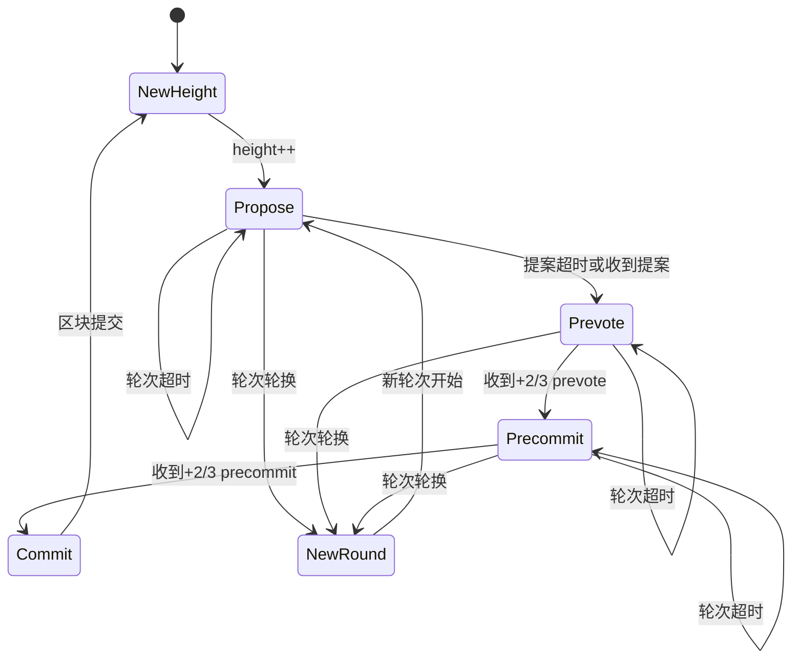

### 1.2 轮次和步骤时间线

```mermaid
gantt
    title Tendermint共识轮次时间线
    dateFormat X
    axisFormat %s
    
    section Round 1
    Propose    :propose, 0, 1
    Prevote    :prevote, 1, 2
    Precommit  :precommit, 2, 3
    Commit     :commit, 3, 4
    
    section Round 2
    Propose    :propose, 4, 5
    Prevote    :prevote, 5, 6
    Precommit  :precommit, 6, 7
    Commit     :commit, 7, 8
```

**时间线说明**:
- 每个轮次包含4个阶段：Propose → Prevote → Precommit → Commit
- 每个阶段持续1个时间单位
- 轮次之间无缝衔接
- 总延迟 = 轮次数 * 4个时间单位

## 2. 提案者选择算法可视化

### 2.1 确定性提案者选择流程图

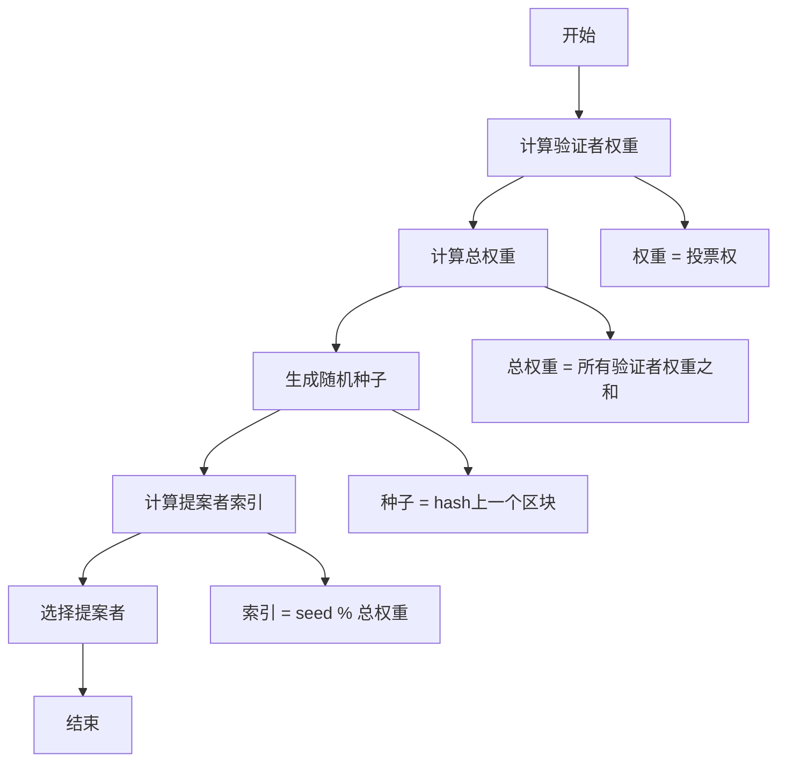

### 2.2 提案者选择公式可视化

```
提案者选择算法:

1. 权重计算:
   W_i = 验证者i的投票权

2. 累积权重:
   C_0 = 0
   C_i = C_{i-1} + W_i

3. 随机种子:
   seed = hash(上一个区块头)

4. 提案者索引:
   target = seed mod 总权重

5. 选择验证者:
   选择满足 C_{i-1} <= target < C_i 的验证者i
```

### 2.3 提案者轮换示例

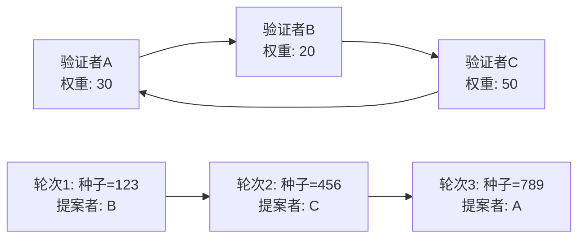

## 3. 投票机制可视化

### 3.1 投票类型和流程

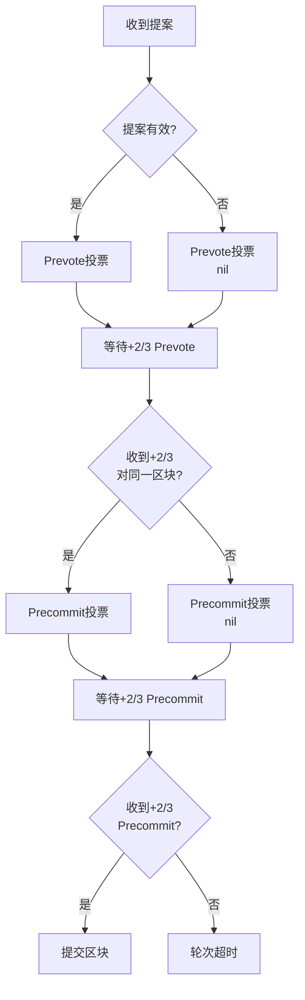

### 3.2 投票权重计算

```
投票权重计算:

1. 总验证者数: N
2. 拜占庭节点数: f (f < N/3)
3. 诚实节点数: N - f
4. 所需多数: 向上取整((2N + 1)/3)

示例 (N=4):
- 总权重: 4
- 拜占庭容忍: 1
- 所需多数: 向上取整((2*4 + 1)/3) = 3
- 安全阈值: 3/4 = 75%
```

### 3.3 投票聚合可视化

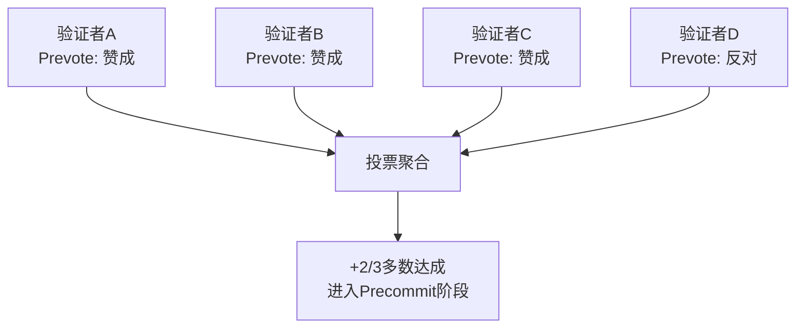

## 4. BFT时间同步可视化

### 4.1 时间戳计算流程

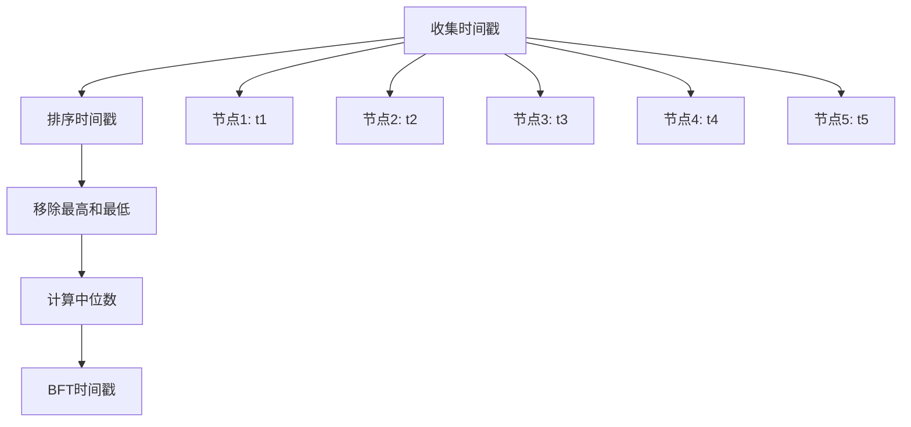

### 4.2 时间同步公式

```
BFT时间同步算法:

1. 收集时间戳:
   T = {t1, t2, ..., tn}

2. 排序:
   T_sorted = sort(T)

3. 移除极值:
   T_filtered = T_sorted[1:n-2]

4. 计算中位数:
   t_bft = median(T_filtered)

5. 时间窗口:
   |t_bft - t_i| <= 最大时间差
```

### 4.3 时间同步示例

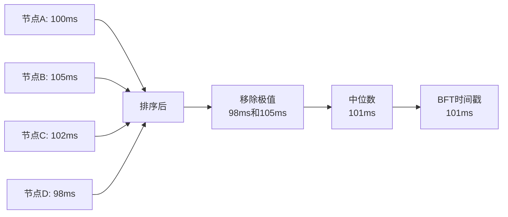

## 5. 证据处理机制可视化

### 5.1 恶意行为检测流程

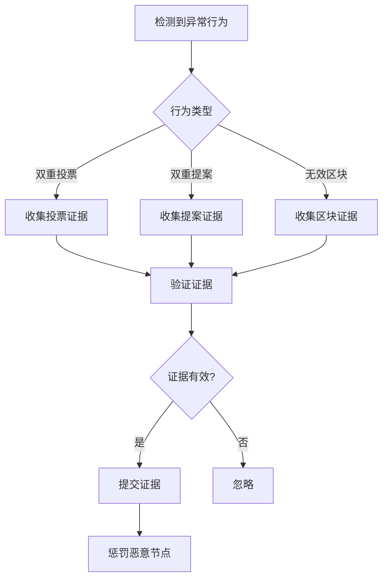

### 5.2 证据结构

```
证据数据结构:

1. 双重投票证据:
   {
     "type": "duplicate_vote",
     "validator": "validator_address",
     "height": "block_height",
     "round": "consensus_round",
     "vote_a": "first_vote",
     "vote_b": "second_vote"
   }

2. 双重提案证据:
   {
     "type": "duplicate_proposal",
     "validator": "validator_address",
     "height": "block_height",
     "round": "consensus_round",
     "proposal_a": "first_proposal",
     "proposal_b": "second_proposal"
   }
```

## 6. 轻客户端协议可视化

### 6.1 轻客户端验证流程

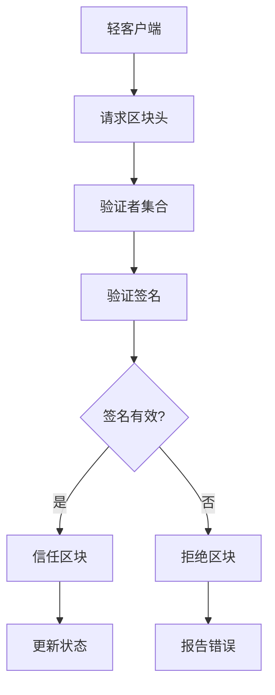

### 6.2 轻客户端状态同步

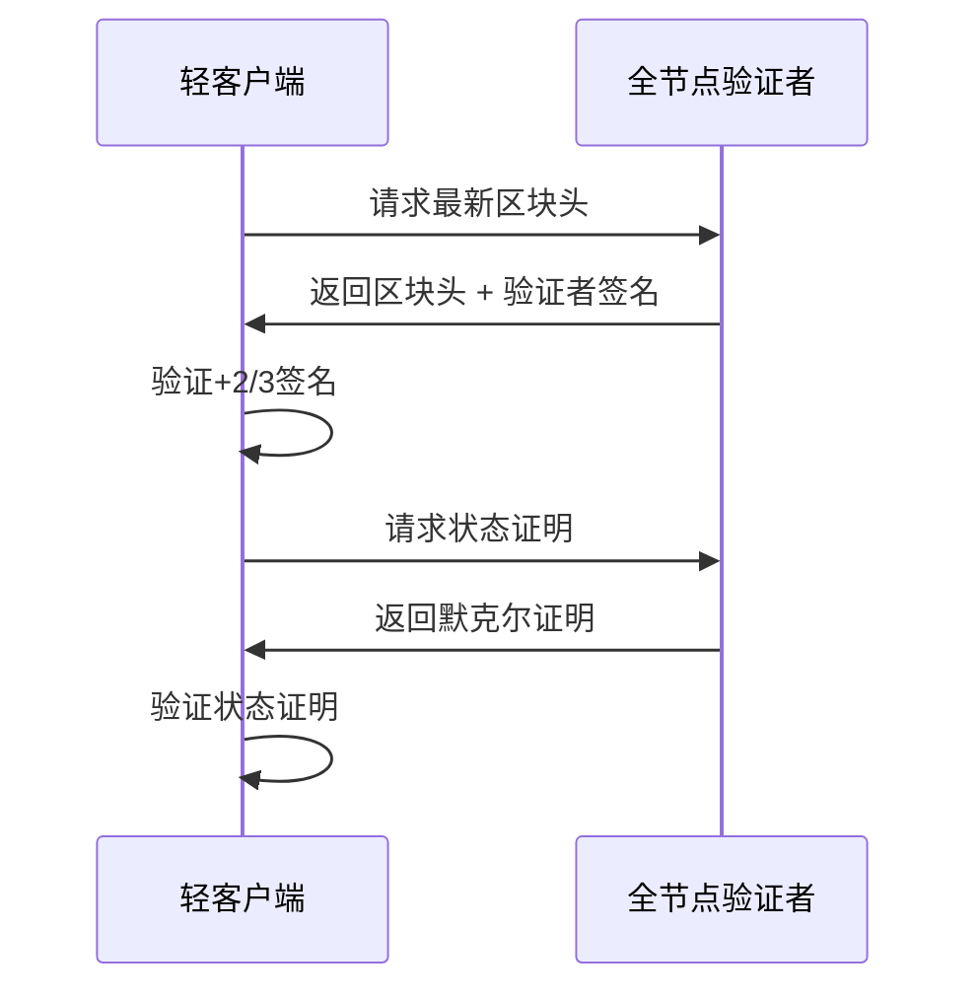

## 7. 安全性证明可视化

### 7.1 安全性证明结构

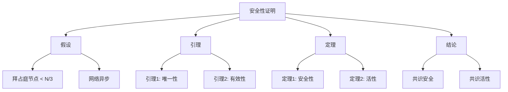

### 7.2 安全性证明公式

```
安全性证明:

1. 假设:
   - 拜占庭节点数: f < N/3
   - 诚实节点数: N - f > 2N/3

2. 唯一性引理:
   如果两个诚实节点在高度h提交了不同的区块，
   则存在矛盾。

3. 安全性定理:
   对于任何高度h，最多有一个区块被提交。

4. 证明:
   假设存在两个区块B1, B2在高度h被提交
   -> 存在+2/3 Precommit对B1
   -> 存在+2/3 Precommit对B2
   -> 存在诚实节点对两个区块都Precommit
   -> 矛盾
```

## 8. 性能分析可视化

### 8.1 吞吐量计算

```
性能指标计算:

1. 区块时间:
   T_block = T_propose + T_prevote + T_precommit + T_commit

2. 吞吐量:
   Throughput = BlockSize / T_block

3. 延迟:
   Latency = T_block * 轮次数

4. 网络复杂度:
   Messages = O(N^2) per round
```

### 8.2 性能优化策略

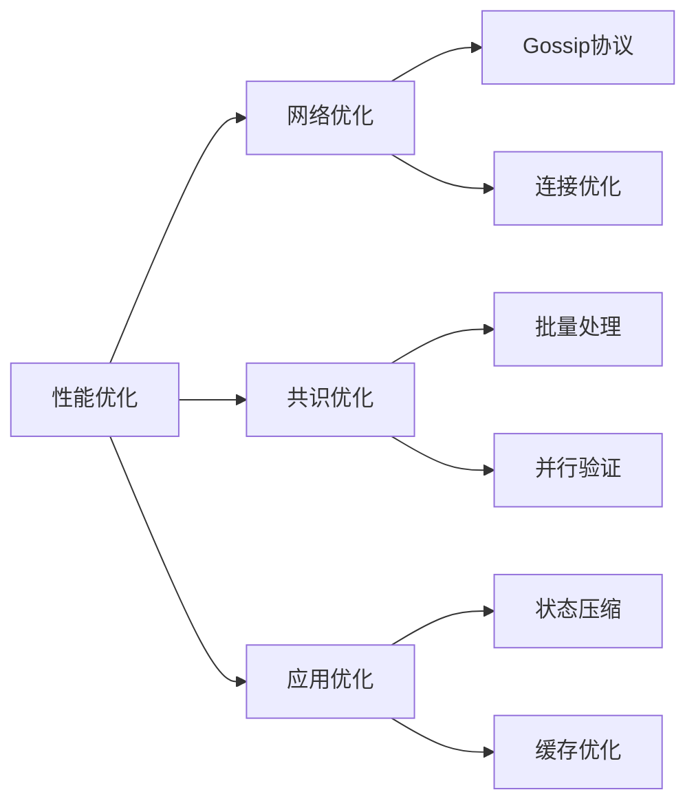

## 9. 故障处理可视化

### 9.1 网络分区处理

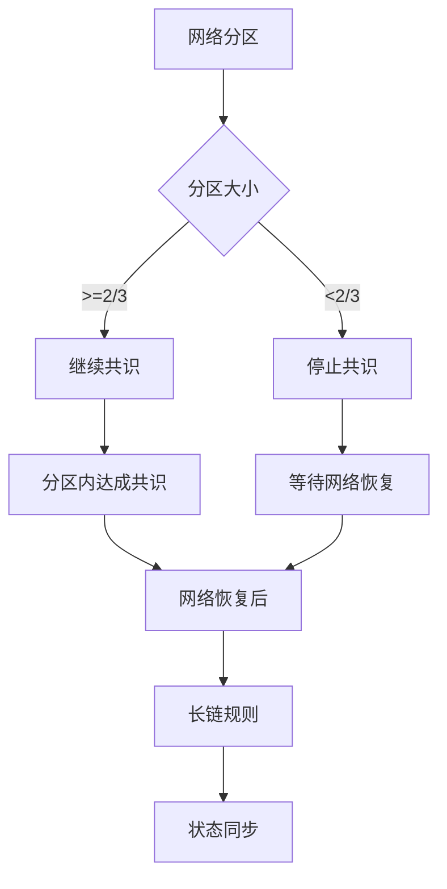

### 9.2 节点故障恢复

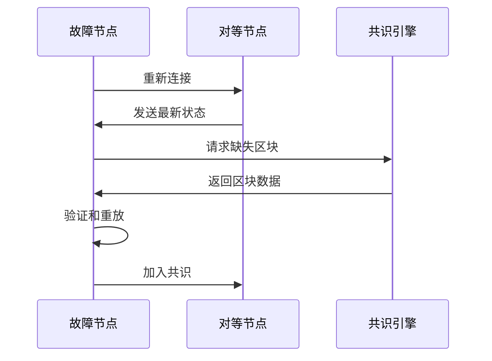

## 10. 配置参数可视化

### 10.1 关键参数关系

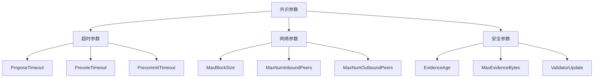

### 10.2 参数调优指南

```
参数调优建议:

1. 超时参数:
   - 网络延迟 < 100ms: 1s, 1s, 1s
   - 网络延迟 100-500ms: 2s, 2s, 2s
   - 网络延迟 > 500ms: 3s, 3s, 3s

2. 区块大小:
   - 高吞吐量: 1MB
   - 平衡模式: 512KB
   - 低延迟: 256KB

3. 验证者数量:
   - 小型网络: 4-10
   - 中型网络: 10-50
   - 大型网络: 50-100
```

## 总结

本文档提供了Tendermint共识算法中各种概念的可视化表示，包括：

1. **状态机图** - 展示共识流程和状态转换
2. **流程图** - 详细的操作步骤和决策点
3. **数学公式** - 关键算法的数学表示
4. **时序图** - 节点间的交互过程
5. **性能分析** - 吞吐量和延迟的计算方法

这些可视化内容可以帮助：
- 更好地理解复杂的协议流程
- 快速掌握关键概念
- 便于教学和培训
- 辅助代码实现和调试

建议结合代码实现和实际测试来验证这些概念的正确性。
