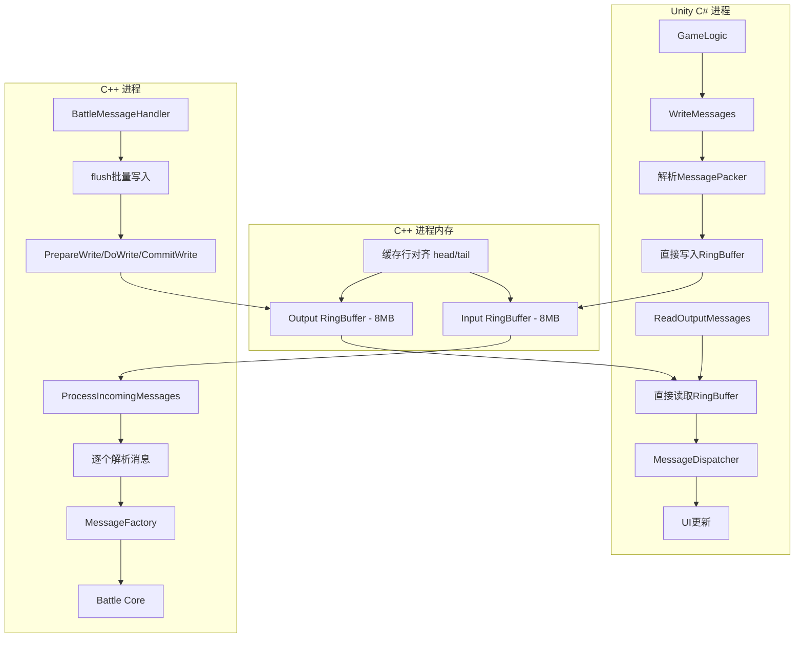

# Unity C++集成架构文档

## 📋 概述

HGameBattle项目采用**RingBuffer + 零拷贝**技术，实现Unity C#与C++战斗逻辑的高性能、无锁、线程安全通信。架构借鉴Disruptor设计理念，采用固定大小预分配策略。

## 🎯 核心概念

### RingBuffer架构 + 固定大小设计

**RingBuffer**: 环形缓冲区实现高效的SPSC（单生产者单消费者）通信模式。

**固定大小**: 借鉴Disruptor设计哲学，预分配固定容量，避免动态扩容带来的性能开销。

```
┌─────────────────────────────────────────────────────┐
│                RingBuffer (8MB)                     │
│  ┌───┬───┬───┬───┬───┬───┬───┬───┬───┬───┬───┬───┐  │
│  │ 0 │ 1 │ 2 │ 3 │ 4 │ 5 │ 6 │ 7 │ 8 │ 9 │...│N-1│  │
│  └───┴───┴───┴───┴───┴───┴───┴───┴───┴───┴───┴───┘  │
│      ↑                           ↑                   │
│    head                        tail                  │
└─────────────────────────────────────────────────────┘
```

### RingBuffer的核心优势

| 特性 | 传统队列 | RingBuffer | 核心优势 |
|------|----------|------------|----------|
| **内存分配** | 动态分配 ❌ | 预分配 ✅ | 避免运行时分配/释放 |
| **缓存友好** | 链表结构 ❌ | 连续内存 ✅ | 优秀的空间局部性 |
| **线程安全** | 需要锁 ❌ | 无锁 ✅ | 原子操作 + 内存屏障 |
| **性能预测** | 不稳定 ❌ | 稳定 ✅ | 固定大小，性能可预测 |

## 🔄 通信流程图



### 操作步骤

**每帧流程**:
1. **Unity**: 收集消息 → 解析MessagePacker格式 → 零拷贝写入RingBuffer → 提交写入
2. **P/Invoke**: 调用 `HGameBattle_Update()` (同步通知)
3. **C++**: 从RingBuffer读取数据 → 逐个解析消息 → 执行战斗逻辑 → 写入输出RingBuffer
4. **Unity**: 从输出RingBuffer零拷贝读取 → 消息分发 → UI更新

## 📊 关键技术特性

| 技术点 | 实现方案 | 核心优势 |
|--------|----------|----------|
| **零拷贝** | 直接内存访问 | Unity和C++操作同一内存区域，无数据传输 |
| **无锁设计** | 原子操作 + 内存屏障 | SPSC模式，使用acquire/release语义 |
| **缓存优化** | 缓存行对齐 | `alignas(64)`避免伪共享，提升性能 |
| **固定容量** | 预分配策略 | 借鉴Disruptor，避免动态分配开销 |
| **环绕处理** | 模运算 | 高效的环形缓冲区实现 |
| **批量优化** | PrepareWrite/DoWrite/CommitWrite | 最小化内存屏障次数 |

## 🚀 性能指标

| 指标 | 数值 | 说明 |
|------|------|------|
| **缓冲区大小** | 8MB × 2 | 输入输出各8MB，固定预分配 |
| **内存拷贝** | 0次 | 真正零拷贝通信 |
| **内存屏障** | 最小化 | 批量写入模式，减少原子操作 |
| **缓存行对齐** | 64字节 | 避免伪共享，优化多核性能 |
| **环绕开销** | O(1) | 位运算优化的模运算 |

## 💻 使用示例

### Unity C# 端

```csharp
// C# -> C++ 通信
void Update() {
    // 零拷贝写入
    WriteMessages();  // 批量写入RingBuffer
    
    // 同步通知（唯一的P/Invoke调用）
    HGameBattle_Update(Time.deltaTime);
    
    // 零拷贝读取
    ReadOutputMessages();  // 批量读取RingBuffer
}

private void WriteMessages() {
    // 1. 获取缓冲区状态
    var stateResult = _getInputBufferStateFunc(ref _context, 
        out IntPtr bufferPtr, out ulong capacity, out ulong head, out ulong tail);
    
    // 2. 计算可用空间（处理环绕）
    ulong availableSpace = (tail >= head) ? 
        capacity - (tail - head) - 1 : head - tail - 1;
    
    // 3. 直接写入RingBuffer内存（处理环绕）
    foreach (var messageData in messages) {
        // 解析MessagePacker格式（大端序）
        ushort messageBodyLength = (ushort)((messageData[0] << 8) | messageData[1]);
        ushort messageId = (ushort)((messageData[2] << 8) | messageData[3]);
        
        // 写入消息头和消息体（小端序，处理环绕）
        WriteMessageWithWrapAround(bufferPtr, capacity, writePos, 
                                   messageBodyLength, messageId, messageData);
    }
    
    // 4. 提交写入
    _commitInputWriteFunc(ref _context, newTail);
}
```

### C++ 端

```cpp
// C++ 读取和处理
void UnityBattleContext::ProcessIncomingMessages() {
    // 零拷贝读取所有数据
    std::string data = input_buffer_->ReadAll();
    
    size_t offset = 0;
    while (offset < data.size()) {
        // 直接解析消息头（小端序）
        uint16_t messageSize = *reinterpret_cast<const uint16_t*>(data.data() + offset);
        uint16_t messageId = *reinterpret_cast<const uint16_t*>(data.data() + offset + 2);
        
        // 提取消息体
        std::string messageBody(data.data() + offset + 4, messageSize);
        
        // 分发消息
        parseAndDispatchMessage(messageId, messageBody);
        
        offset += 4 + messageSize;
    }
}

// C++ 批量写入优化
bool BattleMessageHandler::flush() {
    // 1. 准备写入（1次内存屏障）
    size_t head = 0, tail = 0;
    outputBuffer_->PrepareWrite(&head, &tail);
    
    // 2. 批量写入（0次内存屏障）
    for (auto& queue : priorityQueues_) {
        if (queue->commands_size() > 0) {
            std::string formattedMessage = serializeMessage(*queue);
            outputBuffer_->DoWrite(formattedMessage.data(), 
                                   formattedMessage.size(), &head, &tail);
            queue->clear_commands();
        }
    }
    
    // 3. 提交写入（1次内存屏障）
    outputBuffer_->CommitWrite(head, tail);
}
```

## 🔧 关键实现细节

### 内存管理策略
- **固定预分配**: 启动时分配8MB×2的RingBuffer，运行时不再分配
- **缓存行对齐**: `alignas(std::hardware_destructive_interference_size)`
- **SPSC模式**: 单生产者单消费者，无锁高效

### 原子操作设计
```cpp
// 缓存行对齐，避免伪共享
alignas(std::hardware_destructive_interference_size) std::atomic<size_t> head_{0};
alignas(std::hardware_destructive_interference_size) std::atomic<size_t> tail_{0};

// 内存序优化
head_.store(new_head, std::memory_order_release);
size_t current_head = head_.load(std::memory_order_acquire);
```

### 环绕处理设计
```cpp
// 高效的环绕计算
size_t mask_ = capacity_ - 1;  // 2的幂次容量
size_t wrapped_pos = pos & mask_;  // 位运算替代模运算

// C#端环绕写入
if (writePos + dataSize <= capacity) {
    // 不跨边界
    Marshal.Copy(data, 0, bufferPtr + writePos, dataSize);
} else {
    // 跨边界处理
    int firstPart = (int)(capacity - writePos);
    Marshal.Copy(data, 0, bufferPtr + writePos, firstPart);
    Marshal.Copy(data, firstPart, bufferPtr, dataSize - firstPart);
}
```

### 消息格式统一
```
消息格式: [2字节长度(小端序)][2字节ID(小端序)][消息体]
- 不包含消息总数（与C++端保持对称）
- 直接逐个解析消息
- 大端序MessagePacker → 小端序RingBuffer转换
```

### 错误处理策略
- **数据验证**: 消息ID范围检查、长度合理性验证
- **优雅降级**: 空间不足时跳过写入，记录错误日志
- **边界检查**: 防止缓冲区溢出和读取越界

## 🎯 架构优势

### 性能优势
1. **预分配策略**: 避免运行时内存分配/释放开销
2. **缓存友好**: 连续内存访问，优秀的空间局部性
3. **无锁设计**: SPSC模式，原子操作最小化
4. **批量优化**: 减少内存屏障和系统调用次数

### 可靠性优势
1. **固定容量**: 避免动态扩容的复杂性和不确定性
2. **对称设计**: C#和C++端数据格式完全一致
3. **完整验证**: 多层次的数据校验和错误处理
4. **线程安全**: 原子操作保证SPSC环境下的数据一致性

### 可维护性优势
1. **清晰职责**: PrepareWrite/DoWrite/CommitWrite明确的三步模式
2. **借鉴成熟方案**: 基于Disruptor的成熟设计理念
3. **完善文档**: 详细的实现说明和使用示例
4. **模块化设计**: RingBuffer、MessageFactory、MessageDispatcher独立模块

---

**文档版本**: v5.0 - 基于RingBuffer + 固定预分配架构  
**维护者**: HGameBattle团队  
**更新时间**: 2024年12月  
**架构变更**: 从TripleBuffer迁移到RingBuffer，采用Disruptor设计理念